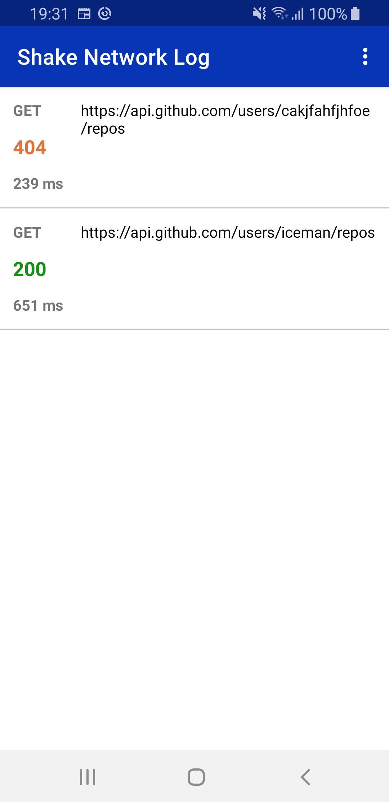
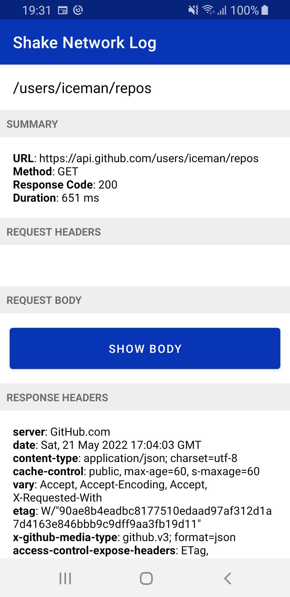
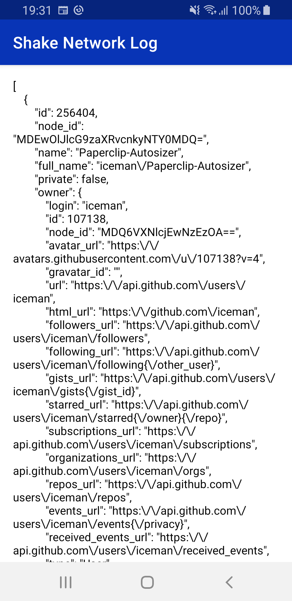

# Introduction 
A lightweight Android library that allows you to fast debug your app's network requests directly on your device simply by shake it.
Few steps: you needs to initialize the library in your custom Application class, start it in your Activity's onCreate and let's the magic happens.

<p align="center">
  
  
  
</p>

# Getting Started

- Setup project (download the .aar and setup it in your project as a local .aar dependency)

```
implementation(files("libs/shakenetworklog-1.0.0-alpha01-release.aar"))
```

- Initialize the library (i.e. in your custom Application's onCreate)

```
NetworkLogManager.init(this)
```

- Start it in your Activity's onCreate

```
NetworkLogManager.start(lifecycle)
```

- Instantiate the NetworkLogInterceptor and pass it to your OkHttp instance

```
val networkLogInterceptor = NetworkLogInterceptor()

val okHttpClient = OkHttpClient.Builder()
    .....
    .addInterceptor(networkLogInterceptor)
    .....
    .build()
```

- Shake your device and you will see the list of your network calls with the related details

# Status
This is an alpha version (1.0.0-alpha01). Updates will be released periodically with new features and bug fixes.

# Contribute


# License

Copyright 2022 Giacomo Piseddu

Licensed under the Apache License, Version 2.0 (the "License");
you may not use this file except in compliance with the License.
You may obtain a copy of the License at

   http://www.apache.org/licenses/LICENSE-2.0

Unless required by applicable law or agreed to in writing, software
distributed under the License is distributed on an "AS IS" BASIS,
WITHOUT WARRANTIES OR CONDITIONS OF ANY KIND, either express or implied.
See the License for the specific language governing permissions and
limitations under the License.
